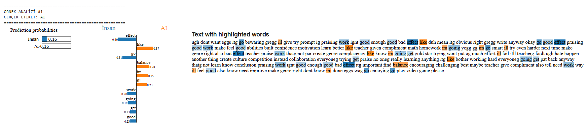

# AI-and-Text-Detection-Analysis
# NLP Tabanlı Metin Sınıflandırma 

Bu proje, metin verilerini analiz ederek *AI* veya *Human* tarafından yazılıp yazılmadığını tahmin eden bir Doğal Dil İşleme çalışmasıdır. Proje kapsamında farklı modeller eğitilmiştir ve **LIME** yöntemiyle model kararlarının açıklanabilirliği sağlanmıştır.

## Kullanılan Teknolojiler ve Kütüphaneler

Bu çalışmada aşağıdaki temel kütüphaneler kullanılmıştır:
* **Veri İşleme:** `Pandas`, `Numpy`, `Re` (Düzenli İfadeler), `Collections` (Counter)
* **Görselleştirme:** `Matplotlib`, `Seaborn`
* **NLP & Vektörleştirme:** `NLTK`, `Scikit-learn` (TF-IDF Vectorizer)
* **Makine Öğrenmesi Modelleri:** Logistic Regression, Naive Bayes, Linear SVM
* **Model Açıklanabilirliği:** `LIME` (Local Interpretable Model-agnostic Explanations)
* **Model Saklama:** `Joblib`

## Çalışma Akışı
1. Veri Seti Analizi: Veri seti sınıf dağılımı incelenmiş, metin uzunlukları analiz edilmiştir.
2. Veri Ön İşleme: Bu aşamada sırası ile veri seti üzerinde lowercasing, noktalama işareti temizliği, tokenization ve stopwords (gereksiz kelimeler) temizliği yapılmıştır.
3. Özellik Çıkarımı: TF-IDF vektörleştirme metodu ile metinler sayısallaştırılmıştır. (TfidfVectorizer)
4. Model Eğitimi: Veri seti train_test_split ile ayrılmış ve modeller eğitilmiştir.
5. Değerlendirme: classification_report ve confusion_matrix ile performans analizi gerçekleştirilmiştir.
6. Hata Analizi: Üç model içinde hatalı tahminler hesaplanmış ve hatalı tahmin edilen metinler incelenmiştir.
7. Açıklanabilirlik: make_pipeline kullanılarak oluşturulan yapı üzerinden LIME Ananlizi ile kelimelerin etkilerinin görselleştirilmesi gerçekleştirilmiştir.

## Dosya Yapısı
1. data: dataset_sample.csv dosyasının içermektedir. Bu dosya kullanılan ve oldukça büyük olan veri setinin sınıf bazlı eşit örnek olacak şekilde bir alt kümesidir.
2. notebooks: exploration.ipynb dosyasını içermektedir. Bu dosyada veri seti analizi gerçekleştirilmiştir.
3. results: Sonuç görselleri (confusion matrix, precision-recall grafiği, model performans tablosu, vb.) yer almaktadır.
4. src: preprocessing.py, feature_extraction.py, train_model.py, evaluate_model.py dosyaları yer almaktadır.
5. requirements.txt: Bu dosya gerekli kütüphaneleri içermektedir.

## Projeyi Çalıştırma Talimatları
Projeyi kendi ortamınızda çalıştırmak için aşağıdaki adımları izleyin:

1. Depoyu klonlayın veya indirin:
   GitHub üzerinden projeyi kendi bilgisayarınıza indirin.
2. Gerekli Kütüphaneleri Yükleyin:
   Terminal veya komut satırını açarak proje dizinine gidin ve şu komutu çalıştırın:
   pip install -r requirements.txt
   Bu komut; pandas, scikit-learn, lime, nltk ve matplotlib gibi gerekli tüm paketleri otomatik olarak yükleyecektir.
3. Google Drive Bağlantısı:
   Dosyalar Google Drive üzerinden veri okuyup yazdığı için, her dosyanın başındaki şu kısmın çalıştığından emin olun:
   from google.colab import drive
   drive.mount('/content/drive')
4. Aşamaları Sırasıyla Çalıştırın:
   Proje modüler bir yapıda olduğu için dosyaları şu sıra ile çalıştırmalısınız:

   1. Preprocessing: Veri temizleme ve ön işleme adımları için ilgili dosyayı çalıştırın.(preprocessing.py)
   2. Feature Extraction: Metinlerin sayısallaştırılması için ilgili dosyayı çalıştırın.(feature_extraction.py)
   3. Model Training: Modellerin eğitilmesi ve joblib ile kaydedilmesi için eğitim dosyasını çalıştırın.(train_model.py)
   5. Evaluation: Başarı metriklerini ve grafiklerini görmek için değerlendirme dosyasını çalıştırın.(evaluate_model.py)
   7. LIME Analysis: Model kararlarının detaylı açıklamaları için LIME dosyasını çalıştırın.(optional_advanced_componend.py)

## Model Performans Sonuçları

Eğitilen modellerin test seti üzerindeki başarı oranları aşağıdaki gibidir:

| Model | Accuracy | Precision | Recall | F1-Score |
| :--- | :---: | :---: | :---: | :---: |
| Logistic Regression | %99,59 | %99,62 | %99,49 | %99,59 |
| Naive Bayes | %97,14 | %97,09 | %96,76 | %96,92 |
| **Linear SVM (En İyi)** | **%99,90** | **%99,91** | **%99,87** | **%99,89** |

## Model Açıklanabilirlik (LIME)

Modelin tahminlerini hangi kelimelere dayandırdığını görmek için LIME analizleri yapılmıştır. 
Aşağıdaki görselde, bir metnin model tarafından "AI" veya "Human" olarak sınıflandırılmasındaki kelime etkileri görülmektedir:

